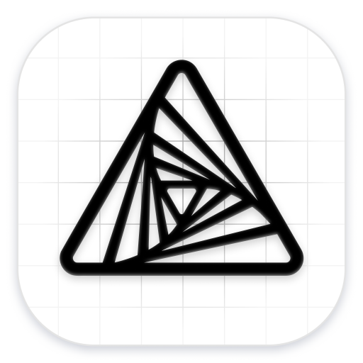
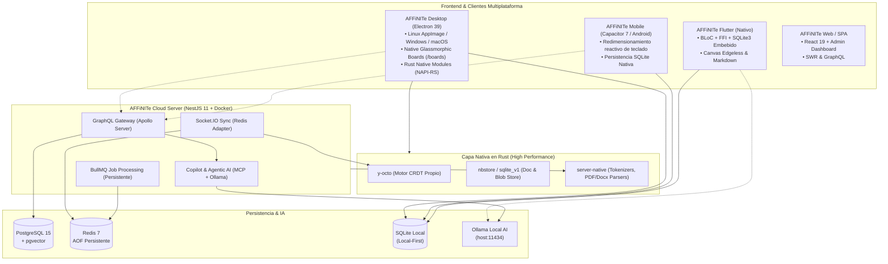

<div align="center">



<h1 style="border-bottom: none; margin-top: 16px;">
    <b>AFFiNITe</b><br />
    <span>Local-First Knowledge, Canvas & Project Boards Workspace</span>
</h1>

<p align="center">
  <b>El espacio de trabajo autónomo, privado y de alto rendimiento que fusiona documentos en bloques, pizarras infinitas y tableros Kanban nativos con sincronización CRDT y modelos de IA locales.</b>
</p>

<p align="center">
  
  
  
  
  
</p>

</div>

---

## 🌟 ¿Qué es AFFiNITe?

**AFFiNITe** es un ecosistema de productividad y gestión del conocimiento de nueva generación diseñado bajo la filosofía **Local-First**. Tus datos residen primero en tu disco duro (SQLite local y memoria CRDT) garantizando velocidad instantánea, soberanía absoluta de datos y funcionamiento sin conexión a internet.

AFFiNITe combina en una sola aplicación fluida:
1. **Editor Hiper-Fusionado**: Documentos modulares en bloques que se transforman en pizarras infinitas (*Edgeless Canvas*) con un solo clic.
2. **Tableros de Proyectos Nativos (`/boards`)**: Sistema Kanban con estética glassmórfica, fondos dinámicos y persistencia directa en el workspace sin requerir bases de datos o servicios externos.
3. **Inteligencia Artificial Local & Privada**: Conexión nativa con **Ollama** (`host.docker.internal:11434`) y **Model Context Protocol (MCP)**, permitiendo consultar LLMs locales sin enviar información confidencial a servidores de terceros.
4. **Suite Completa de PDF**: Visor WebAssembly de alto desempeño (PDFium) y motor de exportación vectorial con soporte para tablas de datos, fórmulas LaTeX y resiliencia 100% offline.

---

## 🚀 Características Principales

### 📋 1. Tableros de Proyectos Nativos (*Project Boards*)
- **Kanban Integrado sin Contenedores**: Tableros organizados en listas, tarjetas con fechas límite, etiquetas y estados directamente almacenados en el árbol CRDT/Yjs.
- **Estética Glassmórfica & Fondos Dinámicos**: Selector visual de fondos de pantalla con transparencias, desenfoques en tiempo real y soporte responsivo móvil/escritorio.
- **Interacción Fluida**: Arrastrar y soltar (*drag & drop*) de tarjetas y columnas con soporte táctil optimizado.

### 📝 2. Canvas & Editor de Documentos Multimodal
- **Bloques Vivos**: Párrafos, encabezados, listas jerárquicas, llamadas destacadas (*callouts*), código con resaltado de sintaxis, fórmulas LaTeX y tablas de bases de datos.
- **Pizarra Infinita (Edgeless Mode)**: Dibuja, conecta notas con conectores inteligentes, inserta marcos, formas vectoriales e imágenes en un lienzo infinito.
- **Exportación Versátil**: Exporta tus notas y pizarras a PDF estructurado, Markdown, HTML o imágenes PNG de alta resolución.

### 🤖 3. Ecosistema de IA Híbrida (Local + Cloud + MCP)
- **Ollama Nativo**: Compatible de fábrica con cualquier modelo de código abierto (`llama3`, `qwen`, `mistral`, `deepseek-r1`) corriendo en tu máquina o servidor local.
- **Model Context Protocol (MCP)**: Conecta herramientas del sistema de archivos, terminales y agentes inteligentes mediante el protocolo estándar MCP.
- **Soporte Multi-Proveedor**: Conmutación transparente hacia proveedores de nube (OpenAI, Anthropic Claude, Google Gemini).

### ⚡ 4. Núcleo Nativo de Alto Desempeño
- **Motor CRDT en Rust (`y-octo`)**: Resolución determinista y sin bloqueo de conflictos de edición en tiempo real.
- **Gestión de Memoria con `jemalloc`**: Optimización de fragmentación de memoria en V8 y bindings nativos en Linux y Docker.
- **Móvil Ultrarrápido**: Reducción de latencia de carga en Android mediante fast-path *Offline-First* y particionado inteligente de paquetes.

---

## 🏛️ Arquitectura del Sistema



---

## 🐳 Despliegue con Docker Compose (Self-Hosted)

Para levantar tu propia instancia de sincronización en la nube con soporte de PostgreSQL, Redis persistente y Ollama:

```bash
# 1. Clonar el repositorio
git clone https://github.com/CodeLoverKawai/Affinite.git
cd Affinite

# 2. Iniciar el stack completo
docker compose up -d
```

El servidor estará disponible de inmediato en **`http://localhost:5320`**.

> [!TIP]
> Si tienes **Ollama** instalado en tu máquina host, el contenedor se conectará automáticamente a través de `host.docker.internal:11434` sin configuración adicional.

---

## 📦 Compilación de Artefactos de Distribución

AFFiNITe incluye pipelines de empaquetado directo en la raíz del proyecto:

| Artefacto | Comando de Compilación | Salida Generada |
|---|---|---|
| **Linux AppImage** | `./build-appimage.sh stable` | `packages/frontend/apps/electron/out/AFFiNITe-linux-x86_64.AppImage` |
| **Android APK** | `./build-apk.sh` | `packages/frontend/apps/android/App/app/build/outputs/apk/stable/release/AFFINITE-release.apk` |
| **Servidor Docker** | `./build-docker.sh [--no-push]` | Imagen `rousseaukairos/affinite:latest` |
| **Release Automatizado** | `./run_release.sh` | Orquesta versionado, builds y publicación en GitHub Releases |

---

## 🛠️ Desarrollo Local

### Requisitos Previos
- **Node.js**: `>=20 <23.0.0` (Recomendado Node 22 LTS)
- **Yarn**: `v4.12.0` (Berry)
- **Rust**: Edición 2024 (Toolchain estable con `cargo`)
- **Docker**: (Opcional, para levantar base de datos de desarrollo)

```bash
# 1. Instalar dependencias del monorepo
yarn

# 2. Inicializar entorno y extensiones
yarn affine init

# 3. Iniciar el servidor de desarrollo
yarn dev
```

---

## 🔒 Privacidad y Soberanía de Datos

- **Cero Telemetría Forzada**: Sentry y los servicios de seguimiento upstream han sido desactivados.
- **Sin Dependencia de Cuentas Propietarias**: Puedes utilizar el 100% de las funciones de tableros, edición, canvas e inteligencia artificial de forma totalmente desconectada o auto-alojada.

---

<div align="center">
  <sub>Construido con pasión por el equipo de desarrollo de <b>AFFiNITe</b>. Licenciado bajo MIT.</sub>
</div>
